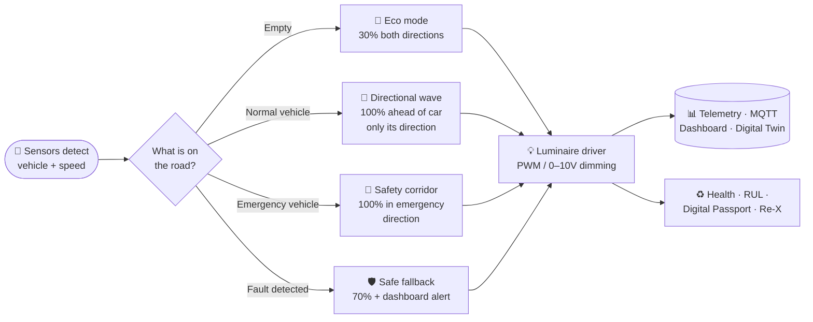
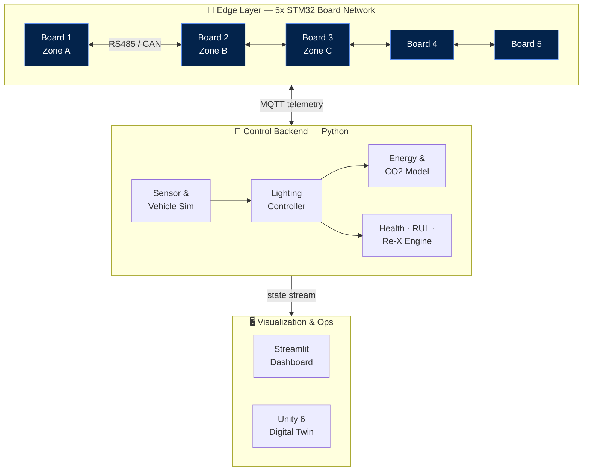

<div align="center">

# 🛣️ Smart Highway Lighting

### Emergency-Aware Adaptive Highway Lighting · Digital Twin · Edge-Controller Board

*A motorway that only lights the road you are actually driving on — and goes brighter the instant an ambulance appears.*

<br/>

[](#)
[](#)
[](#)
[](#)
[](#)


</div>

---

## ✨ Overview

**Smart Highway Lighting** (engine codename **ReLight-X**) is a research-grade prototype for a **6-lane smart motorway lighting system**. Instead of blasting a whole highway at full power all night, it keeps the road in a low-energy "eco" glow and raises only the luminaires that a moving vehicle actually needs — then escalates to a **100% safety corridor** the moment an emergency vehicle is detected.

The system is **simulation-first** by design: it does not assume access to real luminaires or motorway infrastructure, so the full pipeline — sensing → control → lighting → telemetry → lifecycle — runs end-to-end on a laptop, and is wired to drive a **virtual STM32 edge-controller board** and a **Unity 6 digital twin**.

> Built to be credible for lab demonstration, thesis defense, and engineering review — **not** a certified road deployment.

<div align="center">

| 🛣️ Poles | 💡 Luminaires | 🚦 Lanes | 📏 Length | 🧭 Zones | 📡 Sensors | 🔌 Edge Boards |
|:---:|:---:|:---:|:---:|:---:|:---:|:---:|
| **32** | **64** | **6** | **1.24 km** | **8** | **32** | **5 (STM32)** |

</div>

---

## 🧠 How It Behaves



| Situation | Lighting response |
|---|---|
| 🌙 **Empty highway** | Both directions hold a configurable **30% eco brightness** |
| 🚗 **Normal vehicle** | Only luminaires facing the vehicle's direction create a smooth **sequential lighting wave** |
| 🚑 **Emergency vehicle** | Ambulance / police / fire scenarios trigger a **100% safety zone** in the emergency direction |
| ⚠️ **Faults** | Comms, sensor, or degraded-luminaire faults fall back to **70% safe brightness** + dashboard alert |
| ♻️ **Lifecycle** | Every luminaire gets **health, Remaining-Useful-Life, a digital passport, and a Re-X decision** |

---

## 🏗️ System Architecture



The same control logic drives three substitutable front-ends: a **Streamlit ops dashboard**, a **Unity 6 night-highway digital twin**, and a **virtual STM32 board network** (RS485 / CAN / wireless) — all fed by an MQTT telemetry bus.

---

## ⚡ Why It Matters

<div align="center">

| Metric | Value | Notes |
|---|---|---|
| 🌙 Energy saved (empty road) | **≈ 70%** | vs. all-luminaires-at-100% baseline |
| 🚗 Energy saved (single vehicle) | **≈ 63%** | directional wave, opposite direction stays eco |
| 💡 Max power / luminaire | **160 W** | dimmable LED roadway driver class |
| 🌍 Carbon factor | **0.404 kg CO₂ / kWh** | configurable grid intensity |
| 👁️ Detection range | **90 m** | look-ahead vehicle anticipation |

</div>

Targets the real class of **DALI / DALI-D4i, 0–10V / 1–10V, NEMA 7-pin, or Zhaga-D4i** LED roadway luminaires (Schréder IZYLUM-class, Signify Luma / RoadFocus-class). The lab prototype uses simulated PWM / 0–10V dimming; certified DALI/D4i is documented as the future hardware path.

---

## 🧩 Tech Stack

`Python` · `Streamlit` · `Plotly` · `Pandas` · `paho-mqtt / amqtt` · `STM32 (PlatformIO + Wokwi)` · `RS485 / CAN` · `Unity 6 (C#)` · `KiCad (board design)` · `ROS2 / Gazebo (optional)`

---

## 📂 Project Structure

```text
backend/                  Python simulation · MQTT bridge · control · energy · health · Re-X · passports
dashboard/                Streamlit monitoring dashboard
unity_digital_twin/       Lightweight Unity scripts & scene-setup notes
unity_projects/           Full Unity 6 project (open in Unity Hub)
edge_controller_firmware/ Legacy ESP32 PlatformIO firmware notes
board_design/             Board concept · BOM · pin map · KiCad placeholders · PCB visualization
board_simulation_wokwi/   Wokwi STM32 board simulation with RS485/CAN and sensors
data/                     Generated sample JSON / CSV datasets
docs/                     Research documentation, diagrams & thesis study
ros2_gazebo_optional/     Minimal optional ROS2 / Gazebo skeleton
tests/                    Backend smoke tests
```

---

## 🚀 Quick Start

```bash
# 1 — Set up the environment
python3 -m venv .venv
source .venv/bin/activate
pip install -r requirements.txt

# 2 — Generate sample data & run a scenario
python -m backend.main --write-sample-data
python -m backend.main --scenario emergency_ambulance_direction_a --steps 90

# 3 — Launch the live dashboard
streamlit run dashboard/app.py
```

### 🔗 Five-Node Board Network Demo

```bash
source .venv/bin/activate
python tools/run_board_network_demo.py
```
Then open `http://127.0.0.1:8501` and pick **Board Network** in the sidebar.
Detailed guide → [Five-Node Board Demo](docs/five_node_board_demo.md)

### 🎮 Unity 6 Digital Twin

Open `unity_projects/ReLightX_Unity6` in Unity Hub. On first launch the editor script builds the full night-highway scene (`Assets/ReLightX/Scenes/ReLightXHighway.unity`); if it doesn't appear, run **ReLight-X → Build Unity 6 Highway Scene** from the menu. The scene is visualization-only: night highway, traffic, emergency vehicles, selectable vehicle cameras, and adaptive lighting.

### 🎓 Thesis-Style Validation

```bash
source .venv/bin/activate
python tools/run_thesis_validation.py   # → data/runs/thesis_validation/
```

---

## 🎬 Demo Scenarios

| Traffic | Emergency | Fault |
|---|---|---|
| `empty_highway` | `emergency_ambulance_direction_a` | `sensor_fault` |
| `normal_car_direction_a` | `police_fire_direction_b` | `communication_loss` |
| `normal_car_direction_b` | | `degraded_luminaire` |
| `two_cars_opposite` | | |

---

## 📚 Documentation

| | |
|---|---|
| 🧭 [System Architecture](docs/system_architecture.md) | 🧮 [Backend Algorithm](docs/backend_algorithm.md) |
| 📡 [MQTT Protocol](docs/mqtt_protocol.md) | 🔧 [Hardware Architecture](docs/hardware_architecture.md) |
| 🔌 [Board Design](docs/board_design.md) | 🎮 [Unity Digital Twin](docs/unity_digital_twin.md) |
| ✅ [Testing Plan](docs/testing_plan.md) | 🎓 [Master Thesis Simulation Study](docs/master_thesis_simulation_study.md) |
| 📋 [Thesis Demo & Validation Steps](docs/thesis_demo_and_validation_steps.md) | 🔭 [Limitations & Future Work](docs/limitations_and_future_work.md) |

---

## 🗺️ Roadmap

- [ ] Certified **DALI / D4i** dimming interface path
- [ ] Hardware-in-the-loop with a physical STM32 node
- [ ] On-board ML vehicle classifier on the edge
- [ ] Field-grade cybersecurity & surge / EMC hardening

---

## ⚠️ Safety Note

This repository does **not** claim real-world deployment readiness. Roadway lighting controllers must satisfy electrical safety, EMC, surge, photometric, cybersecurity, environmental, and road-authority requirements before any field use.

---

<div align="center">

**Built by [Ashkan Aghamoali](https://github.com/iamashkan)** · ⭐ Star the repo if it sparked an idea

</div>
